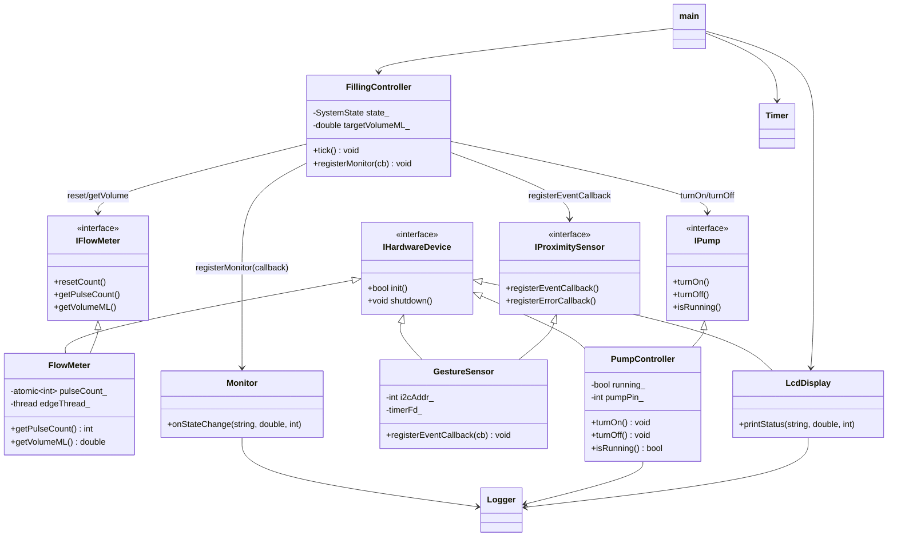
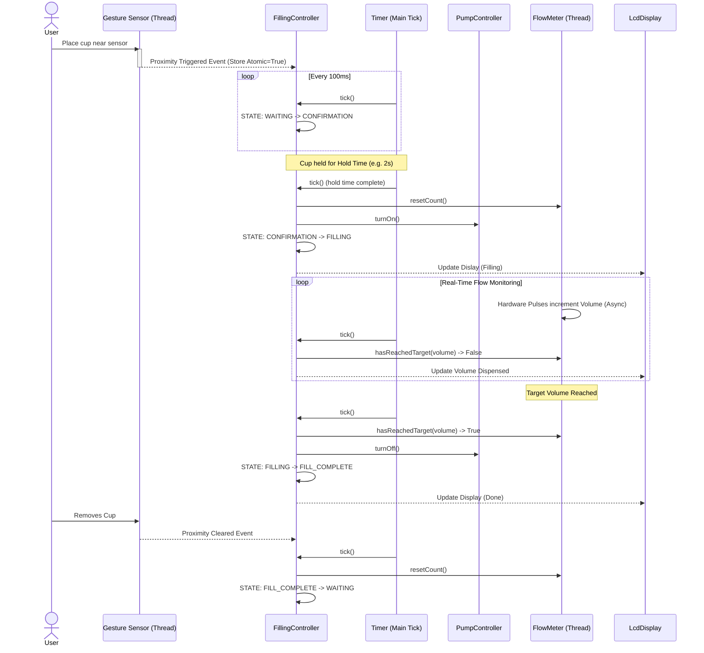
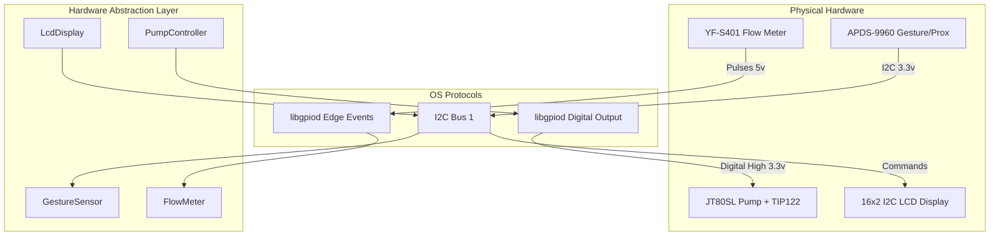

# AquaFlow Architecture

This document presents the overarching software design, sequence flows, and exact components mapping that define the AquaFlow touchless automated dispenser system.

---

## 1. Class Diagram

The following diagram demonstrates the core **SOLID** structural choices made for this system.
Note the heavy reliance on **Dependency Inversion (D)**: The `FillingController` acts only on abstractions (`IHardwareDevice` inputs mapped as concrete injected instances at run-time). It is completely unaware of Linux/GPIO specifics.

## OCP Notes

- Hardware drivers are extendable through `IHardwareDevice` without changing the base interface.
- `FillingController` depends on behavioral abstractions (`IProximitySensor`, `IPump`, `IFlowMeter`) rather than concrete hardware drivers.
- New hardware implementations can be added by extending interfaces and wiring them in composition code without modifying controller logic.

## LSP Notes

- `IHardwareDevice` intentionally defines only lifecycle methods (`init`/`shutdown`). We deliberately did not add a fixed `getData()` shape because a single return type cannot represent all device families without lossy conversions.
- Device data contracts are split into focused interfaces (`IFlowMeter`, `IPump`, `IProximitySensor`). This avoids forcing derived classes to implement irrelevant behavior and keeps substitution safe.
- `GestureEvent` now supports both a backward-compatible scalar (`proximityValue`) and a future-proof payload (`proximityChannels`). New derived sensors can publish multi-channel readings without changing the callback signature.
- Stress evidence: `tests/LiskovSubstitutionStressTest.cpp` repeatedly swaps derived implementations through base pointers and validates lifecycle, callback, and `FillingController` behavior.

---

## 2. Sequence Diagram

This sequence traces the primary temporal flow of operations: From the user placing their cup, through proximity callbacks and flow counting, closing off back to an idle state.

---

## 3. Physical Software Mapping Architecture

This diagram demonstrates how hardware interfaces directly communicate natively with our encapsulated classes to form the whole package.

