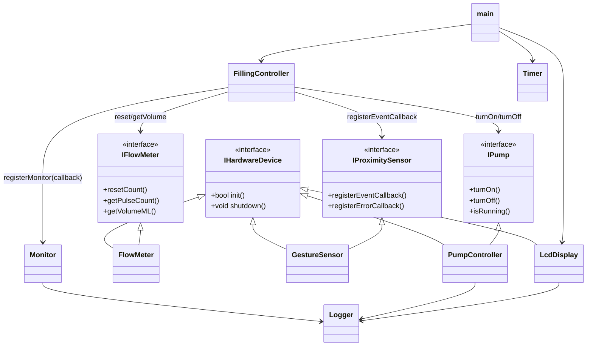

# AquaFlow Architecture

## OCP Inheritance and Dependencies

This diagram documents the inheritance hierarchy and the main composition links relevant to Open/Closed Principle review.

## OCP Notes

- Hardware drivers are extendable through `IHardwareDevice` without changing the base interface.
- `FillingController` depends on behavioral abstractions (`IProximitySensor`, `IPump`, `IFlowMeter`) rather than concrete hardware drivers.
- New hardware implementations can be added by extending interfaces and wiring them in composition code without modifying controller logic.

## LSP Notes

- `IHardwareDevice` intentionally defines only lifecycle methods (`init`/`shutdown`). We deliberately did not add a fixed `getData()` shape because a single return type cannot represent all device families without lossy conversions.
- Device data contracts are split into focused interfaces (`IFlowMeter`, `IPump`, `IProximitySensor`). This avoids forcing derived classes to implement irrelevant behavior and keeps substitution safe.
- `GestureEvent` now supports both a backward-compatible scalar (`proximityValue`) and a future-proof payload (`proximityChannels`). New derived sensors can publish multi-channel readings without changing the callback signature.
- Stress evidence: `tests/LiskovSubstitutionStressTest.cpp` repeatedly swaps derived implementations through base pointers and validates lifecycle, callback, and `FillingController` behavior.
